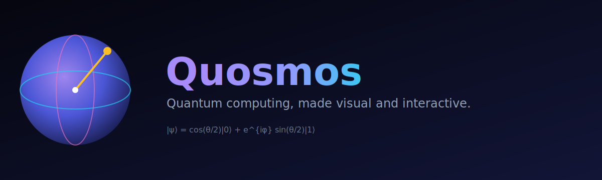

# Quosmos

> A modern, visual, interactive platform that makes quantum computing intuitive.

Quosmos turns abstract quantum mechanics into something you can **see, touch, and play with**: a 3D Bloch sphere you can rotate, a drag-and-drop circuit builder, animated teleportation and superdense-coding walkthroughs, a double-slit lab, an algorithms gallery, gamified challenges, and an integrated tutor.

It feels like Figma + Notion + high-end scientific software — built as an open-source learning environment for everyone from the curious beginner to the working researcher.



---

## Why Quosmos

**Everything is visual.** Whenever a concept can be animated, it is animated. Whenever a concept can be drawn, it is drawn. Text is the fallback, not the default.

- 🪐 **Bloch Sphere Explorer** — interactive 3D single-qubit state with animated gate application.
- 🎛️ **Qubit Sandbox** — sculpt arbitrary states by θ/φ and watch every representation update live.
- 🧩 **Circuit Builder** — drag-and-drop multi-qubit circuits, live statevector, QASM/Qiskit export & import.
- 🔗 **Entanglement Lab** — Bell states, EPR pairs, live correlation statistics.
- 📡 **Superdense Coding** — send 2 classical bits with 1 qubit, step by step.
- ✨ **Teleportation** — animated source → Bell pair → measurement → reconstruction.
- 🌊 **Double-Slit Lab** — wave/particle duality with observation-induced collapse.
- 🧠 **Algorithms Gallery** — Deutsch–Jozsa, Grover, QFT, Shor visualization.
- 🎓 **Quantum Tutor** — contextual explanations for the active module.
- 🏆 **Challenges** — gamified exercises with hints, validation, and progress tracking.

## Tech stack

| Layer | Technology |
|-------|-----------|
| Frontend | React 18, TypeScript, Vite, TailwindCSS, Three.js, Zustand, Recharts |
| Quantum engine (client) | Hand-written TypeScript statevector simulator |
| Backend | Python, FastAPI |
| Quantum engine (server) | Qiskit |
| Testing | Vitest (frontend), PyTest (backend) |

## Quick start

### Option A — Docker (full stack, one command)

```bash
docker compose up --build      # then open http://localhost:8080
```

This builds and runs the nginx-served frontend (port 8080) and the Qiskit backend (port 8000), wired together automatically.

### Option B — local dev

```bash
# 1. Frontend
cd frontend
npm install
npm run dev            # http://localhost:5173

# 2. Backend (optional — app runs standalone without it)
cd backend
python -m venv .venv
source .venv/bin/activate        # Windows: .venv\Scripts\activate
pip install -r requirements.txt
uvicorn app.main:app --reload    # http://localhost:8000
```

The frontend is fully functional on its own thanks to the built-in TypeScript quantum engine. The backend unlocks Qiskit-verified simulation, QASM round-tripping, and the tutor API.

## Deployment

- **Docker Compose** — `docker compose up --build` runs the whole stack (see `docker-compose.yml`).
- **Frontend static hosting** — deploy `frontend/` to Vercel (config in `frontend/vercel.json`) or any static host. The app runs standalone on its built-in engine; point it at a backend by serving the API under `/api`.
- **Backend** — the `backend/Dockerfile` produces a self-contained Qiskit API image.

## Documentation

- [Installation Guide](docs/installation.md)
- [User Guide](docs/user-guide.md)
- [Architecture Guide](docs/architecture.md)
- [Developer Guide](docs/developer-guide.md)
- [Contribution Guide](docs/contributing.md)

## Testing

```bash
cd frontend && npm run test        # Vitest
cd backend  && pytest              # PyTest
```

## License

MIT — see [LICENSE](LICENSE).
